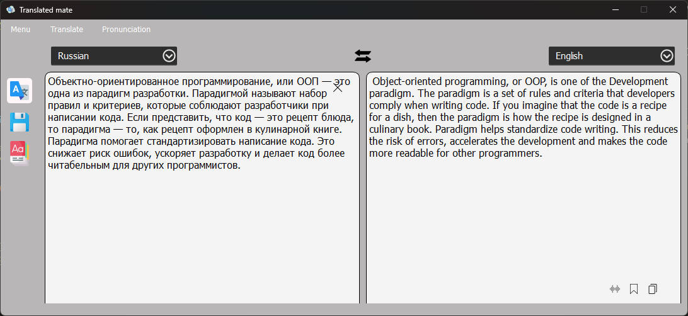

# Translated mate

## Description (Описание)

Переводчик с возможностью переводить текст на различные языки с одного на другой.

Возможности:

- Выбор переводчика:
    - Google (По умолчанию)
    - Deeple (Не стабильный)

- Произношение текста
- Сохранение текста в БД
- Сохранение форматирования переводимого текста
- Сохранение переведённого текста в буфер обмена

На будущее:

- Flash карточки тренировки

## Installation (Установка)

Установка зависимостей: `pip install -r requirements.txt`  
Для конвертации при изменении ui использовать команду: `pyuic6 -x TranslateMate.ui -o ui.py`

## Visual appearance of the programme (Визуальный вид программы)
